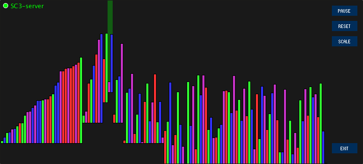

# algosound
  
Project for a computermusic seminar about SuperCollider and SonicPi.

## Index
[What is this project about?](https://github.com/ekzyis/algosound#what-is-this-project-about)  
[How to use](https://github.com/ekzyis/algosound#how-to-use)  
[Update #1 - 29.01.18](https://github.com/ekzyis/algosound#update-1-what-have-i-gotten-myself-into---290118)  
[Update #2 - 09.02.18](https://github.com/ekzyis/algosound#update-2-gen-1-sonification---check---090218)  

### What is this project about?
This project's goal is to create visualization and sonification of algorithms using Processing and SuperCollider.
A good example is this video on YouTube: https://www.youtube.com/watch?v=kPRA0W1kECg&t=36s  
While in the video there are only sorting algorithms, other algorithms like Dijkstra and A* should also be included in this project.

If possible, the sonification should be independent of the algorithm and visual implementation. This will ultimately - as far as I can see - lead to parsing, analyzing and rewriting of the Processing source code to include SuperCollider calls.

First, I am going to make some basic visualization of different algorithms and sonificate them with SuperCollider by using  the network protocol OSC. So to say, I will first do what in the end the "compiling" algorithm should do by itself.

### How to use
For this project, you will need to download Processing and SuperCollider.  

**Processing with oscP5-, supercollider- and controlP5-library**  
The simplest way to obtain Processing is via the official website (download [here](https://processing.org/download/)).  
After downloading, the IDE will ask you where you want to store your ´sketchbook´. This is the default folder where your sketches will be saved. Choose any folder you like.   
After setting up the IDE, you will need to install additional libraries to run the sketches in this repository. But don't worry, the IDE does make it very easy to get those libraries. After opening the IDE, go to ´Sketch´, ´Import library...´ and then ´Add library...´. Search for ´oscP5´ and ´ControlP5´ (both by Andreas Schlegel) and ´SuperCollider client for Processing´ and install them by clicking on the ´Install´-button. They will be downloaded and stored under the path "YOURSKETCHBOOKPATH/libraries/".  
If for some reason you can't download the libraries via the IDE:   
 * Download oscP5 from [here](http://www.sojamo.de/libraries/oscP5/)
 * controlP5 from [here](http://www.sojamo.de/libraries/controlP5/) 
 * supercollider from [here](http://www.erase.net/projects/processing-sc/)
 * and put them yourself into the libraries-folder.
 
 **SuperCollider**  
 You will also need to have SuperCollider installed. Download it from [here](https://supercollider.github.io/download.html) if you don't have it already. The version I am using is 3.9.1. If you are new to SuperCollider, go check out this awesome tutorial playlist:   https://www.youtube.com/watch?v=yRzsOOiJ_p4&list=PLPYzvS8A_rTaNDweXe6PX4CXSGq4iEWYC  
 For this project, you will only need to know how to boot the SuperCollider server and evaluate code.

**Running the sketches**  
After you have done all the steps from above, you are ready to go!  
Clone the repository, go to a folder named after an algorithm (for example, "algosound/bubblesort/") and open any .pde-file. All the other .pde-files should also open up if you are using the IDE since Processing sees a whole folder as one sketch. Therefore, the **folder must be named after a sketch inside it** or Processing will not be able to build the sketch. This is already the case so I recommend to not change the folder-hierarchy of this repository.  
Run the sketch and you should see it after a few moments. Notice the red icon in the top-left corner if you haven't evaluated the code in the parentheses in the .sc-files yet. This means that the sketch can not find the sc3-server with the correct synths for the currently selected sonification. The selected sonification can be checked by looking at the third button from the top at the UI-area on the right. The default sonification is called "SCALE" and thus you should be able to find a button named "SCALE" in the UI area after startup. I recommend to **evaluate all the .sc-files to be able to listen to all available sonifications** (currently (11.02.18) there are only two: "SCALE" and "WAVE".) After evaluating, a boot sound will play to notify you that the sonification is ready and the icon will become green. Choose your sonification and press "START" to start sorting!  
Notice that you can only switch between sonification if the sorting hasn't started yet. You can always reset the algorithm by pressing "RESET".  
Unfortunately due to Processing's build-process and me not thinking early enough about the "bigger picture", you have to run the other sketches in the other folders if you like to run a different algorithm. In the future, the sketches should be bundled inside a native Java application so choosing between the algorithms can be done without running multiple sketches.

### Update #1 "What have I gotten myself into?" - 29.01.18
After some first builds, research about the topic of parsing and trying the sonification, I came to the conclusion that before parsing can be attempted, a deep understanding of SuperCollider, OSC and sonification of algorithms will be needed to produce results worth mentioning. Therefore, I will focus on implementing a sonification I am fine with. This means the following list of algorithms should be sonificated and visualized while being able to work on any given set:
  - Bubblesort
  - Selectionsort
  - Insertionsort
  - Mergesort
  - Quicksort
  - A*
  - Dijkstra
  
 At this point, all sorting algorithms have been implemented and visualized + a basic sonification of bubblesort.
 
### Update #2 "Gen 1 sonification - check" - 09.02.18
All sorting algorithms have been sonificated now.
Sonification consists mainly of a sinewave which is modulated while sorting. The heights of the current accessed elements is mapped to a frequency range. This mapped value is then sent to SuperCollider through OSC, setting the frequency for the sinewave. To prevent sound artifacts due to sudden change of a parameter / to smooth the signal, a Lag UGen is used for the amplitude and frequency. The sinewave is called 'algowave' since the algorithm modulates the (sine)wave. This is the "Generation 1 Sonification". Due to the unharmonic nature of this implementation (which was expected), work on the Gen 2 Sonification has begun. To achieve a more harmonic sound, scales and midi-notes will be used.

This Gen 2 Sonification has been already implemented in bubblesort.

Implementation of the graph algorithms has not started yet because I want to focus more on synths and sonification before starting to implement two algorithms from scratch, including a whole new visualization.
