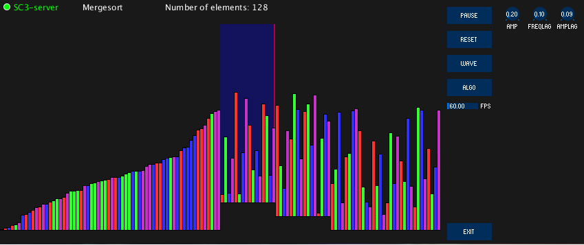

# algosound
  
Project for a computermusic seminar about SuperCollider with ~Processing~ Java and OSC protocol.

## Index
[What is this project about?](https://github.com/ekzyis/algosound#what-is-this-project-about)  
[Getting started](https://github.com/ekzyis/algosound#getting-started)  
[Update #1 - 29.01.18](https://github.com/ekzyis/algosound#update-1-what-have-i-gotten-myself-into---290118)  
[Update #2 - 09.02.18](https://github.com/ekzyis/algosound#update-2-gen-1-sonification---check---090218)  
[Update #3 - 11.02.18](https://github.com/ekzyis/algosound#update-3-finished-gen-2-sonification-and-some-ui---110218)  
--[Update #3.1 - 18.04.18](https://github.com/ekzyis/algosound#update-31-going-from-processing-back-to-java---180418)

### What is this project about?
This project's goal is to create visualization and sonification of algorithms using Processing and SuperCollider.
A good example is this video on YouTube: https://www.youtube.com/watch?v=kPRA0W1kECg&t=36s  
While in the video there are only sorting algorithms, other algorithms like Dijkstra and A* should also be included in this project.

If possible, the sonification should be independent of the algorithm and visual implementation. This will ultimately - as far as I can see - lead to parsing, analyzing and rewriting of the ~Processing~ Java source code to include SuperCollider calls.

First, I am going to make some basic visualization of different algorithms and sonificate them with SuperCollider by using  the network protocol OSC. So to say, I will first do what in the end the "compiling" algorithm should do by itself.

### Getting started

For compiling the source you need these three libraries which are available to download at the specified location (listed in lib/LIB_README).
- Processing: https://processing.org/download/
- OscP5: http://www.sojamo.de/libraries/oscP5/
- ControlP5: http://www.sojamo.de/libraries/controlP5/

Since this repository is in **active development**, there is currently no way of running without building.

To make the process of downloading and unzipping the libraries easier, you can use the script *algosound_lib_dl* inside the lib/ folder.

 **SuperCollider**  
 You will also need to have SuperCollider installed. Download it from [here](https://supercollider.github.io/download.html) if you don't have it already. The version I am using is 3.9.1. If you are new to SuperCollider, go check out this awesome tutorial playlist:   https://www.youtube.com/watch?v=yRzsOOiJ_p4&list=PLPYzvS8A_rTaNDweXe6PX4CXSGq4iEWYC  
 For this project, you will only need to know how to boot the SuperCollider server and evaluate code.

### Update #1 "What have I gotten myself into?" - 29.01.18
After some first builds, research about the topic of parsing and trying the sonification, I came to the conclusion that before parsing can be attempted, a deep understanding of SuperCollider, OSC and sonification of algorithms will be needed to produce results worth mentioning. Therefore, I will focus on implementing a sonification I am fine with. This means the following list of algorithms should be sonificated and visualized while being able to work on any given set:
  - Bubblesort
  - Selectionsort
  - Insertionsort
  - Mergesort
  - Quicksort
  - A*
  - Dijkstra
  
 At this point, all sorting algorithms have been implemented and visualized + a basic sonification of bubblesort.
 
### Update #2 "Gen 1 sonification - check" - 09.02.18
All sorting algorithms have been sonificated now.
Sonification consists mainly of a sinewave which is modulated while sorting. The heights of the current accessed elements is mapped to a frequency range. This mapped value is then sent to SuperCollider through OSC, setting the frequency for the sinewave. To prevent sound artifacts due to sudden change of a parameter / to smooth the signal, a Lag UGen is used for the amplitude and frequency. The sinewave is called 'algowave' since the algorithm modulates the (sine)wave. This is the "Generation 1 Sonification". Due to the unharmonic nature of this implementation (which was expected), work on the Gen 2 Sonification has begun. To achieve a more harmonic sound, scales and midi-notes will be used.

This Gen 2 Sonification has been already implemented in bubblesort.

Implementation of the graph algorithms has not started yet because I want to focus more on synths and sonification before starting to implement two algorithms from scratch, including a whole new visualization.

### Update #3 "Finished gen 2 sonification... and some UI!" - 11.02.18
An user interface has been implemented with the controlP5-library. The UI supports functionality for starting, pausing and resetting the sorting and a button to change between both currently implemented sonifications "WAVE" and "SCALE".

This means of course that the gen 2 sonification has been added to all algorithms. The fundamental process of creating this was about producing harmonic notes - in contrast to the random nature of the previous sonification. Therefore, I created a scale in SuperCollider and mapped the values of the current accessed elements to this scale, producing a harmonic tone which represents the accessed element. The current scale (which should be G#-minor - but I'm not a music expert) is not interchangeable by user input. This should change in the future since it has a lot of potential to increase the overall spectrum of sound, amplified by the combination of other still-to-be-added user input.

Furthermore, I have come to a point where I can no longer keep the sketches separated since this causes (and caused) a lot of unnecessary extra work. When fixing something in one sketch, most of the times the same fix needs to be done in the other sketches. This sounds as annoying as it is. I should have put more thought into how I want to keep a good workflow before writing a lot of code but what has been done can't be undone, I guess.  
My solution to this problem will probably be a single Java application which imports the package processing.core. In native Java code, it will be a lot easier to sustain a good workflow. With abstract classes for the sorting thread implementations, static methods in different utility-classes (which can't be done in Processing code like in Java) and different packages, working on this project will be a lot more fun and less exhausting. The management of the different .sc files for the sonification are also separated, even though there are mostly only minor differences among those files (a lot of copy-paste in there). Uniting them while maintaining the ability to make differences between the sonifications of the algorithms will be another goal for the next update to come.

**Summary of goals for next update**: 
 * Create more user input to enhance sonifications
 * Fix the "copy-and-paste"-issue of the source files

### Update #3.1 "Going from Processing (back) to Java" - 18.04.18

[Update #3](https://github.com/ekzyis/algosound#update-3-finished-gen-2-sonification-and-some-ui---110218) was the last update before my work got evaluated by my professor. After sending in my code, I did spend some time on finishing rebasing the code base on Java code and not Processing code. I am now using <b>IntelliJ IDE</b> and since I didn't talk about this before (but I wished I would) I will list some background information about the project:
* First, I was using the <b>Processing IDE</b>.
* After it got very unhandy to have your open files as a tab, I started using <b>Sublime Text 3</b>. This made it possible to add automated header to files when saving. Since I created files a long time ago before I started using the script, I changed some files manually with the time they "about" got created but I may missed some files or dates. So it would have been very helpful but in the end wasn't.
* Switching to Java meant switching to a real IDE and not an text editor. I could and did compile my code also in Sublime Text 3 - which I like a lot because of its simplicity and plugins - but I missed some features of IDE like the Outline-window and the package explorer. I used <b>NetBeans</b> before, used some <b>Eclipse</b> due to a lecture (which I disliked for unknown reason) and now wanted to try out <b>IntelliJ IDE</b>. 

~~This jump to Java and additional things like new features does mean some paragraphs had been changed backdated like the [section about compiling](https://github.com/ekzyis/algosound#how-to-use---compiling) or [running](https://github.com/ekzyis/algosound#how-to-use---running-the-application).~~ *These paragraphs have been replaced by [Getting started](https://github.com/ekzyis/algosound#getting-started)*

Added features in this update:
* Application bundled: All algorithms are now inside one application!
* FPS slider: User can now speed up or slow down sorting. Speed is measured in Frames per second.
* Input controllers: User can now modify parameters of the synths while sorting
* Pause icon: Visible, animated feedback for the user that sorting has been paused. 
*WARNING: Icon is affected by fps slider. Photosensitive epilepsy patients should proceed with caution.* Don't ask me if this is meant as a joke. I don't know either.

Currently, I am working on overhauling the sonifications since the Sonification class does handle stuff it shouldn't. Algosound should dictate where things should be on the canvas. Only the controller should be created by Sonification. This will make implementing new sonifications or user input a lot easier.

